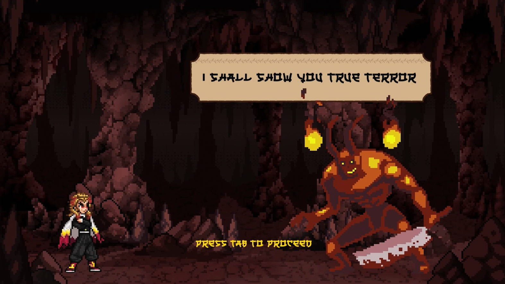
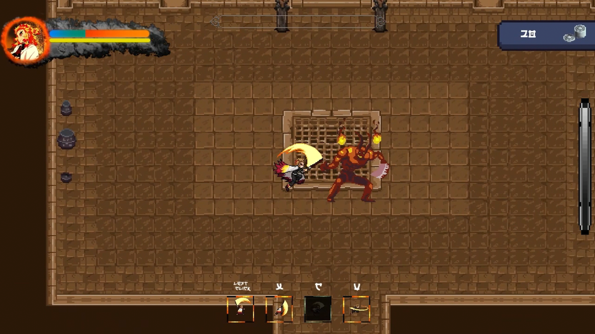

# ⚔️ Dungeon Slayer V2

A 2D action game written in C++ with [SFML](https://www.sfml-dev.org). Fight through rooms and levels of monsters using melee attacks, special skills, a dash, and a charged ultimate.





---

## 📌 Table of Contents

- [Features](#-features)
- [Controls](#-controls)
- [Tech Stack](#-tech-stack)
- [Repository Structure](#-repository-structure)
- [Getting Started](#-getting-started)
- [Credits & License](#-credits--license)

---

## ✨ Features

- **Combat**: a basic attack, three special skills with different cooldowns, a dash, and a run mode.
- **Ultimate**: build up charge, then press **G** to set your heart ablaze (the Ablaze ultimate).
- **Room-by-room progression** through multiple levels. Press **E** to advance after clearing a level.
- **15+ enemy types**, each implemented as its own class: Skeleton, Goblin, Ghoul, Demon, Cacodaemon, Cthulu, Brain Mole, Shard Soul, Night Borne, Arcane Archer, Flame Wizard, Fire Knight, Frost Guardian, Ice Viking, Crystal Mauler, and a boss-style BOD.
- **Data-driven waves**: how many of each monster spawn in each wave is defined in `NumberOfMonsters.csv`, and monsters are placed randomly (`RandomizePlaces`).
- **Full UI**: main menu, pause menu, settings menu, in-game HUD, cutscenes, and game-over and credits screens.
- Animated sprites, blood and hit effects, background music and sound effects.

---

## 🎮 Controls

| Input | Action |
| --- | --- |
| `W` `A` `S` `D` | Move |
| `Left Shift` + move | Run |
| `Space` / Left mouse | Basic attack |
| `X`, `C`, `V` | Special skills (increasing cooldowns) |
| Right mouse | Dash |
| `G` | Ultimate (when charged) |
| `E` | Proceed to the next level |

The in-game instructions screen is also in `instructions.png`.

---

## 🛠 Tech Stack

- **Language**: C++ (C++20 in `CMakeLists.txt`)
- **Library**: [SFML](https://www.sfml-dev.org) 2.6 (graphics, audio, windowing)
- **Build systems**: Visual Studio (`DungeonSlayer.sln`) or CMake (`CMakeLists.txt`)

---

## 📂 Repository Structure

```text
├── DungeonSlayer.cpp      # Entry point and main game loop
├── Menu.* PauseMenu.* SettingsMenu.* GameOver.* GUI.*   # Menus and HUD
├── Monsters.*             # Monster waves, spawning and movement
├── <EnemyName>.cpp/.h     # One class per enemy type
├── RandomizePlaces.*      # Random monster placement
├── globals.* includes.h   # Shared state and headers
├── NumberOfMonsters.csv   # Monster counts per wave
├── enemies/ enemies2/ companions/ walk/ Run/ Dead/ stance/ ...   # Sprite sheets
├── Sound effects/ *.mp3   # Audio
├── include/SFML/ lib/     # SFML headers and libraries
├── DungeonSlayer.sln      # Visual Studio solution
└── CMakeLists.txt         # CMake configuration
```

---

## 🚀 Getting Started

1. Clone the repository:

   ```bash
   git clone https://github.com/AdhamHussam/DungeonSlayerV2.git
   ```

2. Open `DungeonSlayer.sln` in Visual Studio, then build and run (**F5**).

Run the game from the project root so it can find its sprites, sounds and CSV file.

**CMake**: `CMakeLists.txt` expects SFML 2.6.1 (Windows, VC17 64-bit) in the project folder. Edit `SFML_DIR` if yours is elsewhere.

---

## 📜 Credits & License

- Built with [SFML](https://www.sfml-dev.org). The `license.md` in this repository is SFML's license.
- See `Credits.jpg` for in-game credits.

[](https://www.sfml-dev.org)

# SFML — Simple and Fast Multimedia Library

SFML is a simple, fast, cross-platform and object-oriented multimedia API. It provides access to windowing, graphics, audio and network. It is written in C++, and has bindings for various languages such as C, .Net, Ruby, Python.

## Authors

  - Laurent Gomila — main developer (laurent@sfml-dev.org)
  - Marco Antognini — OS X developer (hiura@sfml-dev.org)
  - Jonathan De Wachter — Android developer (dewachter.jonathan@gmail.com)
  - Jan Haller (bromeon@sfml-dev.org)
  - Stefan Schindler (tank@sfml-dev.org)
  - Lukas Dürrenberger (eXpl0it3r@sfml-dev.org)
  - binary1248 (binary1248@hotmail.com)
  - Artur Moreira (artturmoreira@gmail.com)
  - Mario Liebisch (mario@sfml-dev.org)
  - And many other members of the SFML community

## Download

You can get the latest official release on [SFML's website](https://www.sfml-dev.org/download.php). You can also get the current development version from the [Git repository](https://github.com/SFML/SFML).

## Install

Follow the instructions of the [tutorials](https://www.sfml-dev.org/tutorials/), there is one for each platform/compiler that SFML supports.

## Learn

There are several places to learn SFML:

  * The [official tutorials](https://www.sfml-dev.org/tutorials/)
  * The [online API documentation](https://www.sfml-dev.org/documentation/)
  * The [community wiki](https://github.com/SFML/SFML/wiki/)
  * The [community forum](https://en.sfml-dev.org/forums/) ([French](https://fr.sfml-dev.org/forums/))

## Contribute

SFML is an open-source project, and it needs your help to go on growing and improving. If you want to get involved and suggest some additional features, file a bug report or submit a patch, please have a look at the [contribution guidelines](https://www.sfml-dev.org/contribute.php).
